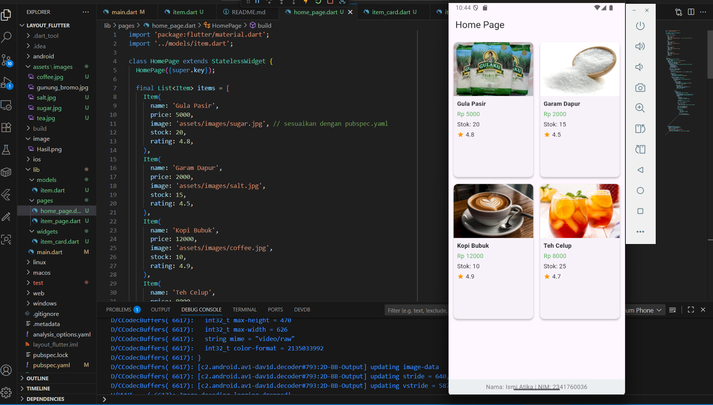
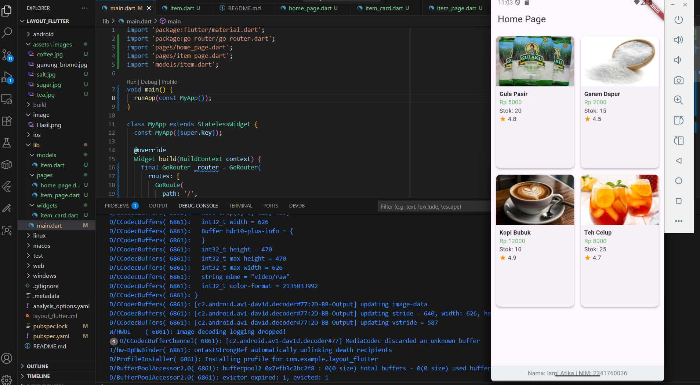

# layout_flutter

A new Flutter project.

## LAPORAN PROJECT FLUTTER LAYOUT-NAVIGASI

**Nama:** Ismi Atika  
**NIM:** 2341760036  
**Kelas:** SIB3C  

---

## Hasil Praktikum 1-4

Berikut adalah hasil akhir dari Praktikum 1-4 yang telah saya kerjakan

Pada Praktikum 1–4 ini fungsinya untuk bagaimana cara memecah antarmuka menjadi elemen dasar (Row, Column, Container), mengatur distribusi ruang menggunakan Expanded, menata tombol secara rapi dengan Row dan MainAxisAlignment.spaceEvenly, serta menambahkan teks dan aset gambar. Perubahan Column menjadi ListView memastikan konten dapat digulir pada perangkat kecil. Hasilnya adalah layout yang modular, mudah diatur, dan responsif terhadap ukuran layar.

## Hasil Praktikum 5-Tugas Praktikum 2 no. 1-5

Berikut adalah hasil akhir dari Praktikum yang telah saya kerjakan

Praktikum 5 fokus pada penerapan navigasi antarhalaman di Flutter. HomePage menampilkan daftar Item menggunakan ListView/GridView. Saat item diketuk, aplikasi memanggil Navigator.pushNamed(context, '/item', arguments: item) untuk mengirim objek ke ItemPage. Tugas lanjutan menambahkan atribut image, stock, dan rating pada model Item, mengubah tampilan menjadi GridView untuk pengalaman marketplace, dan menerapkan Hero pada gambar untuk animasi transisi yang halus. Praktikum ini juga mengajarkan teknik passing data dua-arah (mengembalikan nilai dari halaman detail) dan mengatur kondisi UI (mis. disable tombol saat stock = 0).

## Hasil Tugas Praktikum 2 no. 6

Berikut adalah hasil akhir dari Praktikum yang telah saya kerjakan

Pada tahap akhir (nomor 6) mahasiswa diminta mengkustomisasi aplikasi sehingga siap menjadi proyek kecil yang rapi dan ter-dokumentasi. Kegiatan meliputi pemecahan UI menjadi widget modular (untuk meningkatkan keterbacaan dan reuse), peningkatan tampilan (tema, spacing, interaksi), penambahan footer berisi Nama dan NIM, serta pembuatan dokumentasi lengkap di README.md beserta screenshot

Note: codingan sudah ada di dalam github